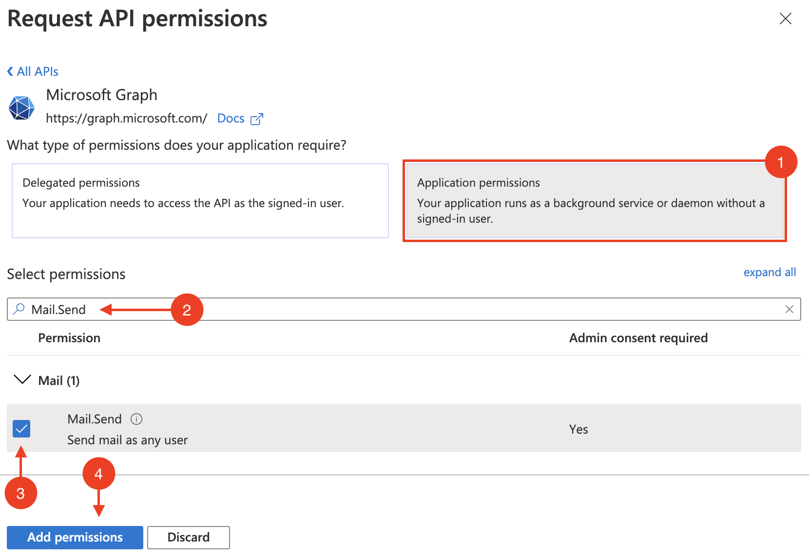

# Send Email using Microsoft Graph on High Severity Finding Notifications

This repository provides a GCP cloud function that will send an email notification using the Microsoft Graph API when a new high severity finding is published to GCP's Security Command Center.

## Overview

- Register a new app in Azure portal and grant it the appropriate permissions to send emails.
- Configure Security Command Center to publish notifications to Cloud Pub/Sub when new high and critical severity findings are created.
- Create and deploy a Cloud Function that subscribes to Cloud Pub/Sub to send email messages to when notifications are received from Cloud Pub/Sub topic.

## Step-by-Step

### Register a New App in Azure Portal

In this section, we will register a new App in Azure that has permission to send emails.

1. Sign in to [Azure portal](https://portal.azure.com/).

1. In the hamburger menu, click **_Azure Active Directory_**.

   

1. Click **_App registrations_**, then click **_New registration_**.

   

1. Under name, type **_SCC Finding Notifider_**, then click **_Register_**.

   

1. Click **_API permissions_**, then click **_Add a permission_**.

   

1. Click **_Microsoft Graph_**.

   

1. Click **_Application permissions_**, then under **_Select permissions_**, filter for `Mail.Send`, check the box next to **_Mail.Send_**, then click **_Add permissions_**.

   

1. Click **_Grant admin consent_**, and confirm by clicking **_Yes_**.

   

1. Click **_Certificates & secrets_**, then click **_New client secret_**. Under description, type **_GCP Cloud Function Secret_**, then click **_Add_**.

   

1. Copy the secret **_Value_** and save it for later.

   

### Gather Client, Tenant, and User IDs

The cloud function that will be sending emails needs the secret and the client and tenant IDs in order to obtain a token. Additionally, the cloud function will also need a user ID that the emails will be sent on behalf of.

1. Click **_Overview_**, then copy **_Application (client) ID_** and **_Directory (tenant) ID_** and save it for later.

   

1. Navigate back to Azure Active Directory by clicking the hamburger menu, and then **_Azure Active Directory_**.

1. Click **_Users_**.

   

1. Click the user you want the cloud function to send emails on behalf of.

   

1. Under the **_Identity_** section, copy the **_Object ID_** and save it for later.

   

### Open a Terminal

The rest of this tutorial will be performed in a terminal.

1. Open a [Cloud Shell Console](https://ssh.cloud.google.com/cloudshell/editor), or a shell with the [gcloud CLI](https://cloud.google.com/sdk/gcloud) installed.

1. Clone this repository locally and make it the current working folder.

   ```console
   git clone https://github.com/shadanan/gcp-scc-finding-notification-azure-email.git
   cd gcp-scc-finding-notification-azure-email
   ```

### Configure the Pub/Sub Topic and Subscription

Cloud Pub/Sub is a real-time messaging service that enables messages to be sent and received between independent applications. A publisher creates a message and publishes it to a feed of messages called a topic. A subscriber receives these messages by way of a subscription. In our case, we'll have a Cloud Function that sends an email when High and Critical severity notifications are published to the topic.

1. In the shell that we prepared at the beginning, set the org and project ID. The selected project is where the Cloud Function will execute form.

   ```console
   export ORG_ID=<your org id>
   export PROJECT_ID=<your project id>
   gcloud config set project $PROJECT_ID
   ```

1. Create the topic where all the findings will be published.

   ```console
   gcloud pubsub topics create scc-critical-and-high-severity-findings-topic
   export TOPIC=projects/$PROJECT_ID/topics/scc-critical-and-high-severity-findings-topic
   ```

1. Configure SCC to publish notifications to our topic.

   ```console
   gcloud scc notifications create scc-critical-and-high-severity-findings-notify \
     --organization $ORG_ID --pubsub-topic $TOPIC \
     --filter '(severity="HIGH" OR severity="CRITICAL") AND state="ACTIVE"'
   ```

### Create a Service Account for our Cloud Function

In this section, we'll provision a service account that will be used by our cloud function. These instructions are adapted from the [public documentation](https://cloud.google.com/security-command-center/docs/how-to-programmatic-access).

1. Create the service account.

   ```console
   export SERVICE_ACCOUNT=email-cloud-function-sa
   gcloud iam service-accounts create $SERVICE_ACCOUNT \
     --display-name "SCC Finding Notifier Email Cloud Function" \
     --project $PROJECT_ID
   ```

1. Grant the service account the `securitycenter.admin` role for the organization.

   ```console
   gcloud organizations add-iam-policy-binding $ORG_ID \
     --member="serviceAccount:$SERVICE_ACCOUNT@$PROJECT_ID.iam.gserviceaccount.com" \
     --role='roles/securitycenter.admin'
   ```

### Save App Secret in Secrets Manager

1. Export the App Secret into an environment variable.

   ```console
   export APP_SECRET=<your-app-secret>
   ```

1. Create the token.

   ```console
   gcloud secrets create azure-app-secret
   ```

1. Set the value of the token.

   ```console
   echo -n $APP_SECRET | gcloud secrets versions add azure-app-secret --data-file=-
   ```

1. Grant your service account access to the token.

   ```console
   gcloud secrets add-iam-policy-binding azure-app-secret \
     --member="serviceAccount:$SERVICE_ACCOUNT@$PROJECT_ID.iam.gserviceaccount.com" \
     --role='roles/secretmanager.secretAccessor'
   ```

### Publish the Cloud Function

1. Set the Client, Tenant, and User IDs.

   ```console
   export CLIENT_ID=<your-app-client-id>
   export TENANT_ID=<your-app-tenant-id>
   export USER_ID=<your-user-id>
   ```

1. Set the recipient email address.

   ```console
   export RECIPIENT=<destination-email-address>
   ```

1. Deploy the `email-azure-high-and-critical-findings` cloud function. If you have not enabled Cloud Build API, then this command may fail. Follow the link in the error message to enable it and then try again.

   ```console
   gcloud functions deploy email-azure-high-and-critical-findings \
     --entry-point=send_email_notification \
     --runtime=python39 \
     --service-account="$SERVICE_ACCOUNT@$PROJECT_ID.iam.gserviceaccount.com" \
     --set-env-vars="PROJECT_ID=$PROJECT_ID,CLIENT_ID=$CLIENT_ID,TENANT_ID=$TENANT_ID,USER_ID=$USER_ID,RECIPIENT=$RECIPIENT" \
     --source=cf \
     --trigger-topic=scc-critical-and-high-severity-findings-topic
   ```

### Test It Out

1. In Security Command Center, manually deactivate and reactivate a high severity finding in order to trigger the cloud function. Ensure **_Show Only Active Findings_** is off so that the findings don't disappear after you deactivate one.

   

1. Check your mailbox!

   
